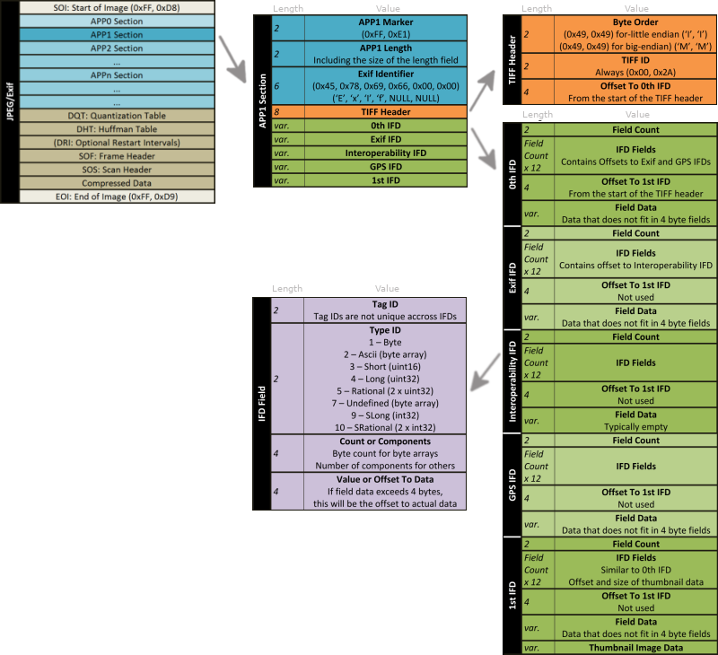

# jparse

[](https://docs.python.org/3/whatsnew/3.7.html)
[](https://choosealicense.com/licenses/mit/)

JPEG structure and Exif metadata parsing library.

## JPEG File Structure



## Requirements

* Python >= 3.7
* No extra dependencies


## Install

```
pip install "jparse @ git+https://github.com/makarovdi/jparse.git@master"
```

## Examples

### Reading TAG value

```python
from jparse import JpegMetaParser, TagPath

tag_image_width = TagPath(app_name='APP1', ifd_number=0, tag_id=0x0100)
tag_date_time = TagPath(app_name='APP1', ifd_number=0, tag_id=0x0132)

with open('image.jpg', 'rb') as f:
    parser = JpegMetaParser(f)

    image_width = parser.get_tag_value(tag_image_width)
    date_time = parser.get_tag_value(tag_date_time)

print(f'Image Width: {image_width}')
print(f'DateTime: {date_time}')
```

Output:
```
Image Width: 4096
DateTime: 2021:03:29 21:27:04
```

### Listing Segments

```python
from jparse import JpegMetaParser

with open('image.jpg', 'rb') as f:
    parser = JpegMetaParser(f)
    
    for seg in parser:
        print(seg)
```

Output:
```
APP1 - Exif - offset: 0x00000002, 3388 bytes
APP2 - IntelMknote - offset: 0x00000D3E, 33072 bytes
APP0 - JFIF - offset: 0x00008E6E, 18 bytes
```

### Listing IFDs

```python
from jparse import JpegMetaParser

with open('image.jpg', 'rb') as f:
    parser = JpegMetaParser(f)

    app1 = parser['APP1']
    print(app1)

    for ifd in app1:
        print(ifd)
```
Output:
```
APP1 - Exif - offset: 0x00000002, 3388 bytes
ImageFileDirectory(fields=12, next_ifd_offset=714, size=246, offset=20)
ImageFileDirectory(fields=3, next_ifd_offset=0, size=42, offset=726)
```


### Listing IFD's fields

```python
from jparse import JpegMetaParser

with open('image.jpg', 'rb') as f:
    parser = JpegMetaParser(f)
    
    app1 = parser['APP1'] # select segment
    ifd1 = app1.ifd[1] # select IFD

    # pring all tags and values
    for tag_id, field in ifd1.fields.items():
        print(f'TAG 0x{tag_id:04X}: {field.value}')
```

Output:
```
TAG 0x0100: 512
TAG 0x0101: 384
TAG 0x0103: 6
TAG 0x0112: 0
TAG 0x011A: 72
TAG 0x011B: 72
...
```


## Debug Logging

```python
import logging
from jparse import JpegMetaParser

logging.basicConfig(format='[%(name)s][%(levelname)s]: %(message)s', level=logging.DEBUG)


with open('image.jpg', 'rb') as f:
    parser = JpegMetaParser(f)
    app1 = parser['APP1']
    app1.load()
```

Output:
```
[jparse][DEBUG]: 0x00000000 -> SOI  : 2 bytes
[jparse][DEBUG]: 0x00000002 -> APP1 : 3388 bytes
[jparse][DEBUG]: 0x00000D3E -> APP2 : 33072 bytes
[jparse][DEBUG]: 0x00008E6E -> APP0 : 18 bytes
[jparse][DEBUG]: 0x00008E80 -> DQT  : 69 bytes
[jparse][DEBUG]: 0x00008EC5 -> DQT  : 69 bytes
[jparse][DEBUG]: 0x00008F0A -> DQT  : 69 bytes
[jparse][DEBUG]: 0x00008F4F -> SOF0 : 19 bytes
[jparse][DEBUG]: 0x00008F62 -> DHT  : 33 bytes
[jparse][DEBUG]: 0x00008F83 -> DHT  : 183 bytes
[jparse][DEBUG]: 0x0000903A -> DHT  : 33 bytes
[jparse][DEBUG]: 0x0000905B -> DHT  : 183 bytes
[jparse][DEBUG]: 0x00009112 -> SOS  : 14 bytes
[jparse][DEBUG]: [APP1] segment loading...
[jparse][DEBUG]: -> name: Exif
[jparse][DEBUG]: -> TiffHeader(byte_order=BIG_ENDIAN, ifd0_offset=8)
[jparse][DEBUG]: -> IDF #0, offset=0x00000014
[jparse][DEBUG]: 		Field[0x0112]:     <FieldType.Short: 3>, count=1  , size=12 , field_offset=0x00000016, value_offset=0x0000001E
[jparse][DEBUG]: 		Field[0x010F]:     <FieldType.ASCII: 2>, count=21 , size=36 , field_offset=0x00000022, value_offset=0x000000AA
[jparse][DEBUG]: 		Field[0x0110]:     <FieldType.ASCII: 2>, count=8  , size=20 , field_offset=0x0000002E, value_offset=0x000000BF
[jparse][DEBUG]: 		Field[0x0131]:     <FieldType.ASCII: 2>, count=25 , size=40 , field_offset=0x0000003A, value_offset=0x000000C7
[jparse][DEBUG]: 		Field[0x011A]:  <FieldType.Rational: 5>, count=1  , size=20 , field_offset=0x00000046, value_offset=0x000000E0
[jparse][DEBUG]: 		Field[0x011B]:  <FieldType.Rational: 5>, count=1  , size=20 , field_offset=0x00000052, value_offset=0x000000E8
[jparse][DEBUG]: 		Field[0x0128]:     <FieldType.Short: 3>, count=1  , size=12 , field_offset=0x0000005E, value_offset=0x00000066
[jparse][DEBUG]: 		Field[0x0213]:     <FieldType.Short: 3>, count=1  , size=12 , field_offset=0x0000006A, value_offset=0x00000072
[jparse][DEBUG]: 		Field[0x0132]:     <FieldType.ASCII: 2>, count=20 , size=32 , field_offset=0x00000076, value_offset=0x000000F0
[jparse][DEBUG]: 		Field[0x0100]:      <FieldType.Long: 4>, count=1  , size=12 , field_offset=0x00000082, value_offset=0x0000008A
[jparse][DEBUG]: 		Field[0x0101]:      <FieldType.Long: 4>, count=1  , size=12 , field_offset=0x0000008E, value_offset=0x00000096
[jparse][DEBUG]: 		Field[0x8769]:      <FieldType.Long: 4>, count=1  , size=12 , field_offset=0x0000009A, value_offset=0x000000A2
[jparse][DEBUG]: -> IDF #1, offset=0x000002D6
[jparse][DEBUG]: 		Field[0x0201]:      <FieldType.Long: 4>, count=1  , size=12 , field_offset=0x000002D8, value_offset=0x000002E0
[jparse][DEBUG]: 		Field[0x0202]:      <FieldType.Long: 4>, count=1  , size=12 , field_offset=0x000002E4, value_offset=0x000002EC
[jparse][DEBUG]: 		Field[0x0103]:     <FieldType.Short: 3>, count=1  , size=12 , field_offset=0x000002F0, value_offset=0x000002F8
```

## License

This software is licensed under the `BSD-3-Clause` license.  
See the [LICENSE](LICENSE) file for details.

## Links

* [Description of Exif file format](https://www.media.mit.edu/pia/Research/deepview/exif.html)
* [Exif Format v2](https://www.kodak.com/global/plugins/acrobat/en/service/digCam/exifStandard2.pdf)
* [Exif Overview](https://www.cipa.jp/std/documents/e/Exif3.0-Overview_E.pdf)
* [ExifLibrary for .NET](https://www.codeproject.com/Articles/43665/ExifLibrary-for-NET)
* [The Metadata in JPEG files](https://dev.exiv2.org/projects/exiv2/wiki/The_Metadata_in_JPEG_files)
* [Manufacturer-specific Tags](https://exiftool.org/TagNames/JPEG.html)

## TODO

Check the plan for new features [here](TODO.md).